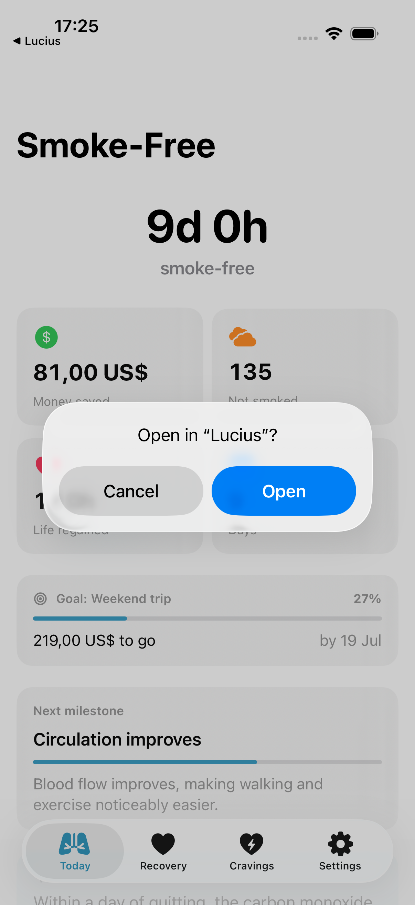
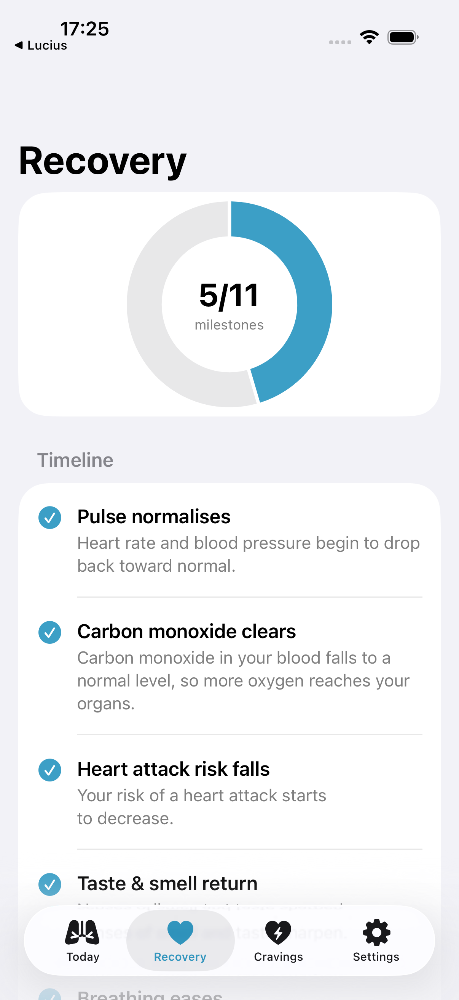
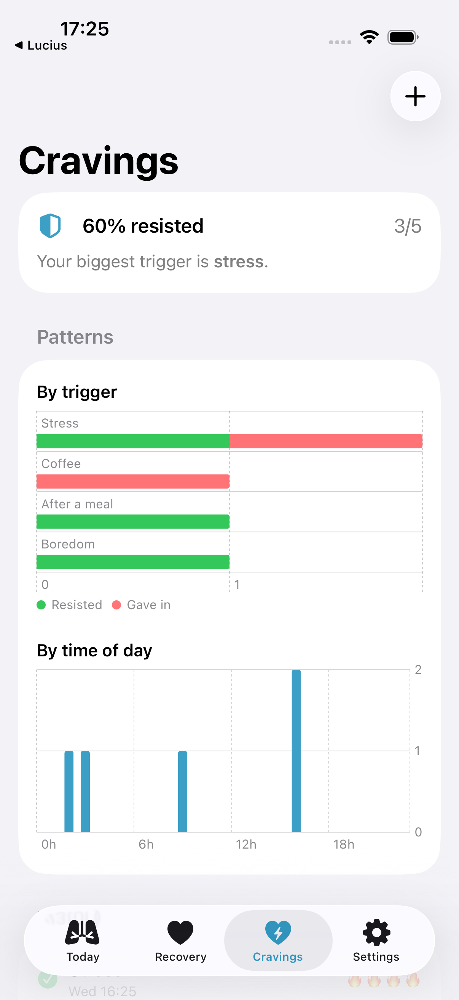
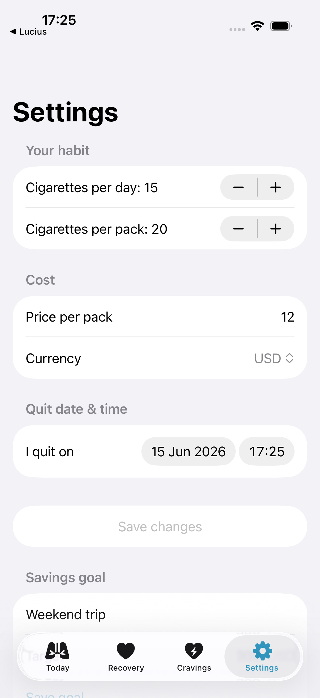
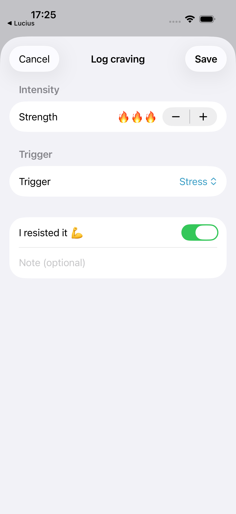
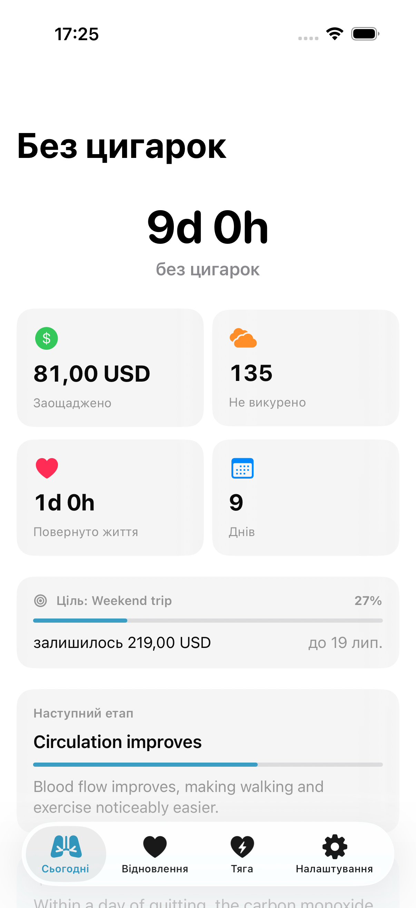
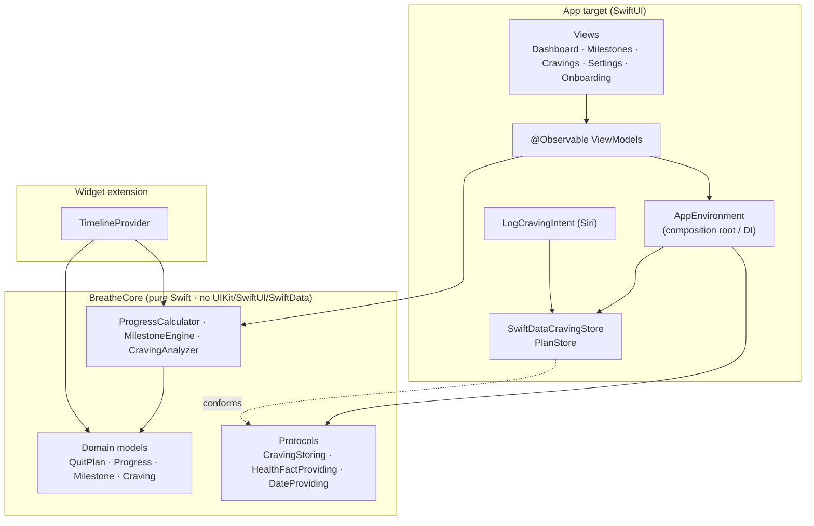

# Breathe 🫁

A smoke-free companion for iOS. Breathe tracks every hour, cigarette and dollar
you reclaim after your last cigarette, shows your body's recovery timeline, and
helps you log and understand cravings so you can spot your triggers.

Built with **SwiftUI**, **SwiftData** and **Swift 6 strict concurrency** as a
focused demonstration of how I structure a production iOS app.

> **Status:** MVP. The domain layer is fully unit-tested and the app, widget and
> App Intent build clean under Swift 6 complete concurrency checking.

## Screenshots

| Today | Recovery | Cravings | Settings | Log a craving |
|:---:|:---:|:---:|:---:|:---:|
|  |  |  |  |  |

The dashboard also localises fully — here it is in Ukrainian:



<sub>Captured automatically from the iOS simulator by a UI test (`UITests/ScreenshotTests.swift`) running against a seeded, in-memory environment.</sub>

---

## Highlights

- **Live dashboard** — time smoke-free, money saved, cigarettes avoided and life
  regained, recomputed every second with animated numeric transitions.
- **Recovery timeline** — an 11-stage health-recovery model (grounded in NHS/CDC
  guidance) rendered as a timeline and a Swift Charts progress ring.
- **Craving log + insights** — record cravings, their triggers and whether you
  resisted; the app surfaces your resistance rate and biggest trigger.
- **Craving analytics** — Swift Charts breakdowns of cravings *by trigger*
  (resisted vs gave in) and *by time of day*.
- **Savings goal** — set a target ("a trip"); the dashboard shows progress and a
  projected date you'll reach it, computed from your daily savings rate.
- **Milestone reminders** — opt-in local notifications fire the moment your body
  reaches the next recovery milestone.
- **Localised** — full English and Ukrainian via a String Catalog.
- **Editable plan** — change your quit date *and time*, daily count, pack size,
  price and currency at any point; every statistic recomputes from it.
- **Home Screen widget** — a daily health-recovery fact, self-contained so it
  runs on any account (no App Group required). See below for extending it into a
  personalised stats widget.
- **Siri / Shortcuts** — "Log a craving in Breathe" via an `AppIntent`, so a
  craving can be logged without opening the app.
- **Offline-first** — the motivational fact-of-the-day is fetched from a remote
  endpoint but always falls back to bundled content.

## Architecture

The codebase is split into a **pure, framework-free domain core** and a thin
**SwiftUI presentation layer**, wired together at a single composition root.



### Why it's structured this way

| Decision | Rationale |
|---|---|
| **`BreatheCore` imports nothing but `Foundation`** | All business logic (money math, recovery timeline, craving insights) is pure and testable on any platform, with no simulator needed — it runs in seconds with `swift test`. |
| **Protocols at the boundaries** (`CravingStoring`, `HealthFactProviding`, `DateProviding`) | The domain depends on abstractions, not on SwiftData or `URLSession`. Tests inject in-memory and stub doubles; production injects the real implementations at `AppEnvironment`. |
| **Injectable clock** (`DateProviding`) | Time-dependent logic is tested deterministically against fixed instants instead of `Date()`. |
| **`Decimal` for money** | Currency never touches `Double` — a test pins exact-cent arithmetic that floating point would get wrong. |
| **`@Observable` + `@MainActor` ViewModels** | Modern Observation framework; views stay declarative and hold no logic. |
| **`actor` / `@ModelActor` persistence** | The SwiftData store is a serialised actor, so reads and writes are concurrency-safe under Swift 6. |
| **App Group (opt-in)** | When enabled, the app, widget and App Intent share one source of truth for the quit plan and craving store; the store falls back to a local container when it isn't configured, so the app always runs. |

## Project layout

```
Breathe/
├── Packages/BreatheCore/        # Pure domain core + its test suite
│   ├── Sources/BreatheCore/
│   │   ├── Models/              # QuitPlan, Progress, HealthMilestone, Craving, SavingsGoal, …
│   │   ├── Services/            # ProgressCalculator, MilestoneEngine, CravingAnalyzer, SavingsGoalCalculator, providers
│   │   └── Support/             # DateProviding, ProgressFormatter
│   └── Tests/BreatheCoreTests/  # 29 unit tests (Swift Testing)
├── App/
│   ├── App/                     # Entry point, AppEnvironment (DI), LogCravingIntent
│   ├── Persistence/             # SwiftData store, PlanStore, shared container
│   ├── Services/                # NotificationService (UserNotifications)
│   ├── Resources/               # Assets, Localizable.xcstrings (en + uk)
│   └── Features/                # Dashboard, Milestones, Cravings, Settings, Onboarding (MVVM)
├── Widget/                      # WidgetKit extension
└── project.yml                  # XcodeGen project definition
```

## Getting started

Requires **Xcode 26** (Swift 6.0) and [XcodeGen](https://github.com/yonsm/XcodeGen).

```bash
# 1. Generate the Xcode project (it is not committed — see .gitignore)
brew install xcodegen
xcodegen generate

# 2. Open and run
open Breathe.xcodeproj
```

In Xcode, select the **Breathe** scheme and an iOS Simulator, then run. The app
builds and runs with any signing team out of the box — no special capabilities
required.

### Personalised stats widget (optional — needs a paid account)

The shipped widget is **self-contained** — it shows a daily recovery fact and
runs on any account, including a free Apple ID on a real device.

To turn it into a personalised widget (days / money saved / cigarettes avoided),
the widget needs to read the app's data through an **App Group**, which requires
a paid Apple Developer Program membership — free provisioning does not support
App Groups on device. The data layer already supports this path:

1. Pick a unique group id, e.g. `group.<your-bundle-id>`.
2. Set it in `App/Persistence/PlanStore.swift` (`appGroup`) and the widget.
3. Uncomment the `CODE_SIGN_ENTITLEMENTS` lines in `project.yml`, set that id in
   both `*.entitlements` files, run `xcodegen generate`, and enable the **App
   Groups** capability for both targets in Xcode.

Without this step everything still runs and the data layer falls back to a local
store.

### Running the tests

```bash
cd Packages/BreatheCore
swift test
```

```
✔ Test run with 29 tests in 8 suites passed.
```

## Testing strategy

The domain core is exhaustively unit-tested because that is where the logic
worth protecting lives:

- **`ProgressCalculator`** — continuous accrual, flooring, exact decimal money,
  and the before-quit-date edge case.
- **`MilestoneEngine`** — achievement flips, chronological ordering, partial
  progress, monotonic counts.
- **`CravingAnalyzer`** — resistance rate, top-trigger tie-breaking, clamping,
  and the by-trigger / by-hour breakdowns that drive the charts.
- **`SavingsGoalCalculator`** — progress fraction, remainder, reached-state and
  the projected ETA from the daily savings rate.
- **`RemoteHealthFactProvider`** — decoding, network-failure fallback, malformed
  JSON fallback, and deterministic per-day selection — all without a real
  network, via a stubbed `DataFetching`.

The UI layer is intentionally thin enough that its correctness follows from the
tested core plus SwiftUI previews for every screen.

## Possible next steps

- Streak-freeze / relapse handling in the plan model
- Interactive widget actions (log a craving from the Home Screen)
- Snapshot tests for the SwiftUI screens
- iCloud sync via SwiftData's CloudKit integration

## License

[MIT](LICENSE)
